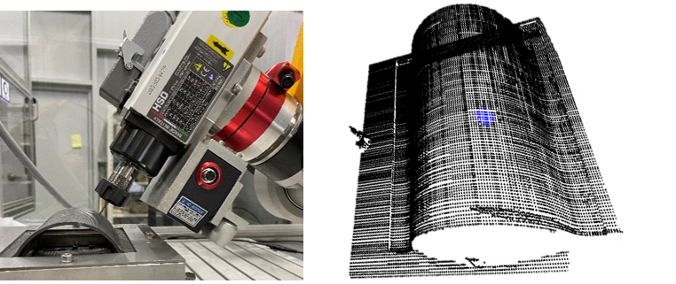

# Direct drilling for unknown surface with high stiffness posture planning
Unfinished Project pkg for my master thesis....  
someday i might finish it with some sort of simulation...  
Study period : 2021.01 ~ 2021.11
# Overview
Machining on unknown surface often requries, such as repairing made product that has no CAD data. In this package, depth camera and line scanner were used to generate point cloud of unknown surface. Depth camera used for extracting abstract scanning path which requires for scanning with line scanner. Since depth camera not able gives accurate position values, high resolution line scanner was used to scan unknown surface. Drilling can be done by selecting drilling point position and orientation that acquired from KNN segmentation for normal vector estimation. For better hole quality, high stiffness posture planning was done using reinforcement learning and stiffness estimation model.

# Overall architecture
## **Scanning surface & Direct drilling**
  

## **Posture optimization**
  

# Surface generatioon
### Used Sensor : Keyence LJ, Intel D435i  

## **Segmentation**
 

## **Scanned result**
  

## **Scanning path**

## **drilling**

# Node map
# Node launch & run 
### spawn and control robot
    roslaunch staubli_tx90_gazebo spawn_tx90.launch  
    roslaunch staubli_tx90_gazebo move_groupd.launch  
    roslaunch staubli_val3_driver motion_streaming.launch  
### scan path planning
    rosrun realsense2_camera demo_pointcloud.launch  
    rosrun tx90_path_planner preprocessing_pointcloud  
    rosrun tx90_path_planner extract_boundary  
    rosrun tx90_path_planner scan_path_ydir.py
### scanning to generate surface
    rosrun tx90_moveit_client scan_trajgen_sub  
    rosrun keyence_ros gen_surface  
    rosrun keyecen_ros pptk_view.py
    rosrun keyence_ros load_np.py
### Normal vector estimation and reaching
    rosrun tx90_path_planner normal_vector_est  
    rosrun tx90_moveit_client tx90_client.py  
